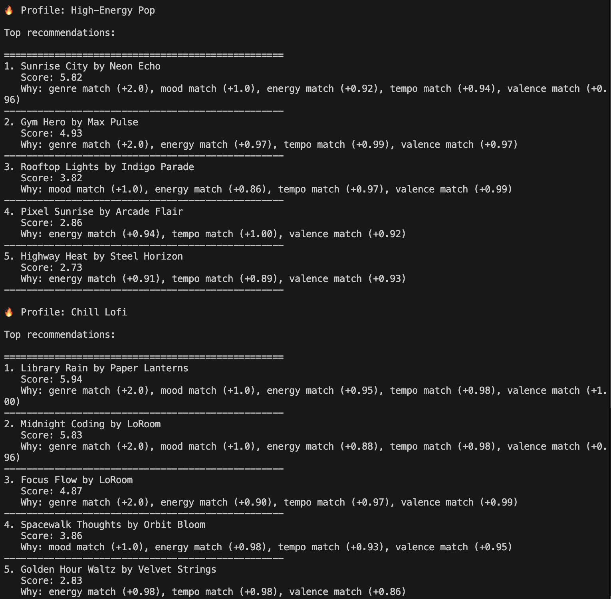

# 🎵 Music Recommender Simulation



## Project Summary

In this project you will build and explain a small music recommender system.

Your goal is to:

- Represent songs and a user "taste profile" as data
- Design a scoring rule that turns that data into recommendations
- Evaluate what your system gets right and wrong
- Reflect on how this mirrors real world AI recommenders

This project implements a CLI-based music recommender system that ranks songs based on how well they match a user's preferences. It combines categorical features like genre and mood with numerical features like energy, tempo, and valence to compute a similarity score. The system outputs the top recommendations along with explanations for why each song was selected.
---

## How The System Works

Real-world recommendation systems combine item metadata with user preferences to suggest the songs that are most likely to fit a listener's current taste. My version will prioritize broad content signals like genre and mood first, then fine-tune the score using numerical audio features so the chosen songs feel both stylistically right and emotionally close to the user's preference.

- `Song` features used in the simulation:
  - `genre`
  - `mood`
  - `energy`
  - `tempo_bpm`
  - `valence`
  - `danceability`
  - `acousticness`

- `UserProfile` information stored:
  - preferred `genre`
  - preferred `mood`
  - preferred numeric values for `energy`, `tempo_bpm`, `valence`, `danceability`, and `acousticness`

The recommender computes a score for each song by measuring how closely the song's features match the user profile, then ranks songs by descending score to choose the best recommendations.

### Algorithm Recipe

- `genre_score = 2.0` if `song.genre == user.genre`, else `0.0`
- `mood_score = 1.0` if `song.mood == user.mood`, else `0.0`
- `energy_score = 1.0 - abs(song.energy - user.energy)`, clamped to [0, 1]
- `tempo_score = 1.0 - (abs(song.tempo_bpm - user.tempo_bpm) / 200)`, clamped to [0, 1]
- `valence_score = 1.0 - abs(song.valence - user.valence)`, clamped to [0, 1]
- `total_score = genre_score + mood_score + energy_score + tempo_score + valence_score`

This recipe prioritizes categorical features (genre, mood) with fixed bonuses, then adds continuous fine-tuning scores for energy, tempo, and valence to capture audio similarity.

### Potential Biases

- This system over-prioritizes genre matches (2.0 points), which could hide songs from other genres that perfectly match the user's mood and energy.
- Tempo and valence are treated equally to energy, but users may weight them differently.
- The system ignores `danceability` and `acousticness`, which may be important to some listeners.
- Users who care more about vibe (mood + energy) than style (genre) may feel under-served by this recipe.

---

## Getting Started

### Setup

1. Create a virtual environment (optional but recommended):

   ```bash
   python -m venv .venv
   source .venv/bin/activate      # Mac or Linux
   .venv\Scripts\activate         # Windows

2. Install dependencies

```bash
pip install -r requirements.txt
```

3. Run the app:

```bash
python -m src.main
```

### Running Tests

Run the starter tests with:

```bash
pytest
```

You can add more tests in `tests/test_recommender.py`.

---

## Experiments You Tried

Use this section to document the experiments you ran. For example:

- What happened when you changed the weight on genre from 2.0 to 0.5
- What happened when you added tempo or valence to the score
- How did your system behave for different types of users

---

## Limitations and Risks

Summarize some limitations of your recommender.

Examples:

- It only works on a tiny catalog
- It does not understand lyrics or language
- It might over favor one genre or mood

You will go deeper on this in your model card.

---

## Reflection

Read and complete `model_card.md`:

[**Model Card**](model_card.md)

Write 1 to 2 paragraphs here about what you learned:

This project showed me how simple scoring rules can create surprisingly realistic recommendations. Even though the system only uses a few features, it still captures important aspects of musical taste like energy and mood.

I also learned how bias can easily appear in recommender systems. For example, giving genre a high weight caused certain songs to dominate results, even when other songs matched better numerically. This made me realize how small design decisions can strongly affect outcomes in real-world AI systems.


---

## 7. `model_card_template.md`

Combines reflection and model card framing from the Module 3 guidance. :contentReference[oaicite:2]{index=2}  

```markdown
# 🎧 Model Card - Music Recommender Simulation

## 1. Model Name

Give your recommender a name, for example:

> VibeFinder 1.0

---

## 2. Intended Use

- What is this system trying to do
- Who is it for

Example:

> This model suggests 3 to 5 songs from a small catalog based on a user's preferred genre, mood, and energy level. It is for classroom exploration only, not for real users.

---

## 3. How It Works (Short Explanation)

Describe your scoring logic in plain language.

- What features of each song does it consider
- What information about the user does it use
- How does it turn those into a number

Try to avoid code in this section, treat it like an explanation to a non programmer.

---

## 4. Data

Describe your dataset.

- How many songs are in `data/songs.csv`
- Did you add or remove any songs
- What kinds of genres or moods are represented
- Whose taste does this data mostly reflect

---

## 5. Strengths

Where does your recommender work well

You can think about:
- Situations where the top results "felt right"
- Particular user profiles it served well
- Simplicity or transparency benefits

---

## 6. Limitations and Bias

Where does your recommender struggle

Some prompts:
- Does it ignore some genres or moods
- Does it treat all users as if they have the same taste shape
- Is it biased toward high energy or one genre by default
- How could this be unfair if used in a real product

---

## 7. Evaluation

How did you check your system

Examples:
- You tried multiple user profiles and wrote down whether the results matched your expectations
- You compared your simulation to what a real app like Spotify or YouTube tends to recommend
- You wrote tests for your scoring logic

You do not need a numeric metric, but if you used one, explain what it measures.

---

## 8. Future Work

If you had more time, how would you improve this recommender

Examples:

- Add support for multiple users and "group vibe" recommendations
- Balance diversity of songs instead of always picking the closest match
- Use more features, like tempo ranges or lyric themes

---

## 9. Personal Reflection

A few sentences about what you learned:

- What surprised you about how your system behaved
- How did building this change how you think about real music recommenders
- Where do you think human judgment still matters, even if the model seems "smart"

